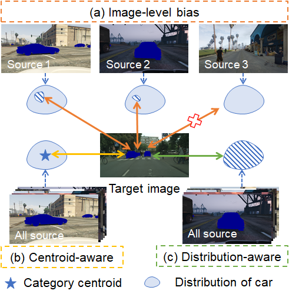

# SDCA

Pytorch Implementation for Semantic Distribution-aware Contrastive Adaptation for Semantic Segmentation.

**Update on 2021/05/12: ArXiv Version of SDCA is available at  [this https URL](https://arxiv.org/abs/2105.05013).**

### Introduction

In this paper, we present a new *semantic distribution-aware contrastive adaptation* algorithm, dubbed as SDCA, that enables pixel-wise representation alignment across domains under the guidance of the semantic distributions. To be precise, we first design a novel contrastive loss at pixel level by considering the correspondences between the semantic distributions and pixel-wise representations from both domains. Essentially, clusters of pixel representations from the same category are obliged to cluster together and those from different categories are obliged to spread out, boosting segmentation capability of the model. Next, an upper bound on this formulation is derived by implicitly involving the simultaneous learning of an infinite number of (dis)similar pixel pairs, making it highly efficient. 



<!-- <br> -->

### 


### Prerequisites

- Python 3.6
- Pytorch 1.7.1
- torchvision from master
- yacs
- matplotlib
- GCC >= 4.9
- OpenCV
- CUDA >= 10.1

**Step-by-step installation**

```bash
conda create --name sdca -y python=3.6
conda activate sdca

# this installs the right pip and dependencies for the fresh python
conda install -y ipython pip

pip install ninja yacs cython matplotlib tqdm opencv-python imageio mmcv tqdm torchvision==0.8.2 torch==1.7.1
```


### Data Preparation

- Download [The Cityscapes Dataset](https://www.cityscapes-dataset.com/)
- Download [The SYNTHIA-RAND-CITYSCAPES Dataset](http://synthia-dataset.net/download/808/)
- Download [The GTAV Dataset](https://download.visinf.tu-darmstadt.de/data/from_games/)
- Download [The Cross-city Dataset](https://yihsinchen.github.io/segmentation_adaptation/)

**The data folder should be structured as follows:**

```
├── datasets/
│   ├── cityscapes/     
|   |   ├── gtFine/
|   |   ├── leftImg8bit/
│   ├── synthia/
|   |   ├── RAND_CITYSCAPES/
|   |   ├── synthia_label_info.p
│   ├── gtav/
|   |   ├── images/
|   |   ├── labels/
|   |   ├── gtav_label_info.p
│   ├── crosscity/	
|   |   ├── Rio/
|   |   ├── Rome/
|   |   ├── Taipei/
|   |   ├── Tokyo/	
│   └──	
```

**Symlink the required dataset**

```bash
ln -s /path_to_cityscapes_dataset datasets/cityscapes
ln -s /path_to_synthia_dataset datasets/synthia
ln -s /path_to_gtav_dataset datasets/gtav
ln -s /path_to_NTHUDatasets datasets/crosscity
```

**Generate the label statics file for SYNTHIA and GTAV Datasets by running** 

```
python datasets/generate_synthia_label_info.py -d datasets/synthia -o datasets/synthia/
python datasets/generate_gtav_label_info.py -d datasets/gtav -o datasets/gtav/
```


### Inference Using Pretrained Model

<details>
  <summary>
    <b>(1) SYNTHIA -> Cityscapes</b>
  </summary>

Download the [pretrained model (VGG-16)](https://drive.google.com/file/d/1FIJY7u7zNThJON9TBPF4XqUyn9VFPwKS/view?usp=sharing) (43.5 mIoU / 50.3 mIoU*) and save it in `results/`. Then run the command 
```bash
python test.py -cfg configs/deeplabv2_vgg16_ssl_synthia.yaml resume results/vgg_s2c_best.pth
```

Download the [pretrained model (ResNet-101)](https://drive.google.com/file/d/1pU2DT3fG0gbgH2ACBSKxe3rrHGPf2Eg1/view?usp=sharing) (50.2 mIoU / 56.8 mIoU*) and save it in `results/`. Then run the command 
```bash
python test.py -cfg configs/deeplabv2_r101_ssl_synthia.yaml resume results/r101_s2c_best.pth
```
</details>


<details>
  <summary>
    <b>(2) GTAV -> Cityscapes</b>
  </summary>

Download the [pretrained model (VGG-16)](https://drive.google.com/file/d/1kK4hTVfLb5XowFYrmGzAQsAtl_sag9BZ/view?usp=sharing) (47.3 mIoU) and save it in `results/`. Then run the command 
```bash
python test.py -cfg configs/deeplabv2_vgg16_ssl.yaml resume results/vgg_g2c_best.pth
```

Download the [pretrained model (ResNet-101)](https://drive.google.com/file/d/1yQXi0N3wuL-yHXN22nVHlST3gCCp84jE/view?usp=sharing) (52.9 mIoU) and save it in `results/`. Then run the command 
```bash
python test.py -cfg configs/deeplabv2_r101_ssl.yaml resume results/r101_g2c_best.pth
```
</details>


### Train

**We provide the training script using 4 Tesla V100 GPUs.**

```
bash train_with_ssl.sh
```


### Evaluate

```
python test.py -cfg configs/deeplabv2_r101_ssl.yaml resume results/r101_g2c_ours_ssl
```


### Acknowledgments

This code is heavily borrowed from [FADA](https://github.com/JDAI-CV/FADA).  

## Citation
If you find it useful to your research, please give credit to the following paper

```
@article{Li_2021_SDCA,
  title={Semantic Distribution-aware Contrastive Adaptation for Semantic Segmentation},
  author={Shuang Li, Binhui Xie, Bin Zang, Chi Harold Liu, Xinjing Cheng, Ruigang Yang, and Guoren Wang},
  journal={arXiv preprint arXiv:2105.05013},
  year={2021}
}
```
